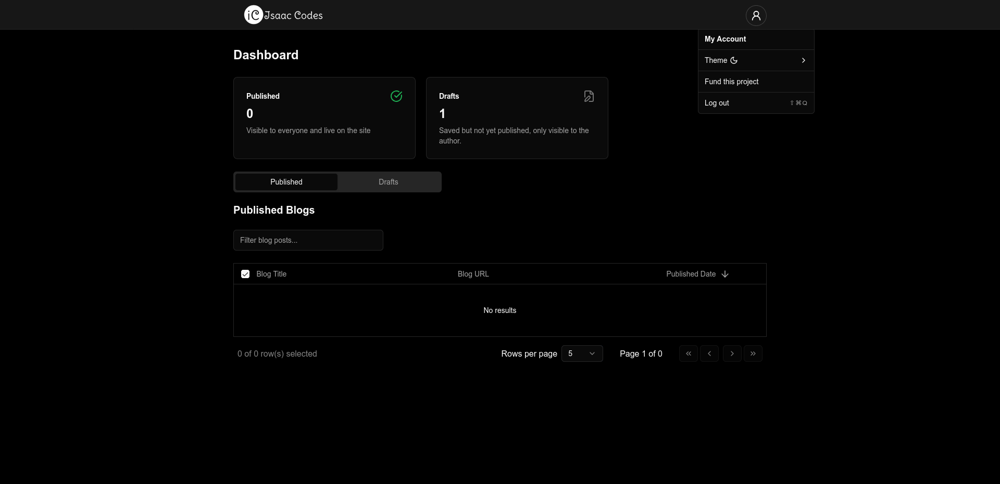

# Overview

This project allows you to effortlessly launch your blog by writing posts in Markdown. It handles the publishing process seamlessly, so you can focus on creating content while it takes care of the rest. I’ve always wanted to help others create modern blog websites with minimal code and no programming experience—this project is the solution.

**Key Features**

- Simple user dashboard used to create and manage your blog posts.
- User authentication - setup your own credentials
- Sharable blog posts - Ability to share your blog posts to other social networks.

**Technologies Used**

- [Nextjs (reactjs)](https://nextjs.org/)
- Vercel Blob - [learn more](https://vercel.com/storage/blob)
- [Tailwindcss](https://tailwindcss.com/)
- [Gray-matter](https://www.npmjs.com/package/gray-matter)

## Installation and Setup

### **Create your credentials**

For you to setup your credentials, you need to download the appropriate binary for your operating system [here](https://github.com/katongole-isaac/blog/releases/tag/v0.1 "credentials-cli")

- **For Windows** - Download `credentials-win.exe`
- **For MacOS** - Download `credentials-macos`
- **For Linux** - Download `credentials-linux`

**Usage**

For windows

- Open a terminal (Command Prompt or PowerShell) and navigate to the downloaded file's location.
- Run the following command

```sh
.\credentials-win.exe
```

For macos or linux

- Open a terminal and run the following commands

Navigate to your downloads

```sh
cd Downloads
```

Setup execute permission to the file

```sh
chmod +x credentials-linux
```

Run it

```sh
./credentials-linux
```

NOTE: You will need to setup environment variables with the generated user credentials.  
**Please keep them safe**

### Environment Variables

For those who are deploying on vercel you might find [this](https://vercel.com/docs/projects/environment-variables) useful on how to setup environment variables in the project dashboard.

## Customization & Configuration

You might want to do some customization forexample changing the app logo, app name, and others. For this i assume you have some basic knowledge on how Nextjs(App router) works.  
But if you don't have, feel free to shoot me an [email](mailto:katongolelsaac78@gmail.com) i might help you get it done in minutes.

**What you can change**

- Timezone used to refernce the time for blog posts (defaults to `Africa/Kampala`)
- Domain to be used (you can supply yours in `.env.production` file)
- Google Analytics ID (supply yours in `.env` file)
- App logo and app name
- Anything you feel like as long as you're comfortable with reactjs and Nextjs in particular.

## Deployments

### Docker

When using Docker, you need to clone this repository and build your own version of the image with your configurations.  
I have included guidelines in the docker files to guide you through when creating an image but i will also reference them here.

- **How to build your docker image**
  > I assume that you're using docker compose for building your image

clone this repository

```sh
git clone https://github.com/katongole-isaac/blog
```

Navigate to blog direcory

```sh
cd blog
```

**Buiilding docker image**

<small>you need to provide your own values for these environment variables </small>

> NEXT_PUBLIC_GOOGLE_TAG_MANAGER_ID='' # optional  
> NEXT_PUBLIC_BASE_URL=''  
> NEXT_PUBLIC_TIMEZONE=''

```sh
docker compose -f dev.docker-compose.yml build
```

**Test your image locally**

> NOTE: You need to provide values for the environment variables in `docker-compose.yml`

> To create credentials, you can use a credentials-cli tool. [Download](https://github.com/katongole-isaac/blog/releases/tag/v0.1)

> To obtain the BLOB_READ_WRITE_TOKEN, navigate to your Vercel Dashboard and retrieve the value from your account settings.

> once you have all the values, you can create a file named `.env.local` and paste all the environment variables.
>
> Forexample
>
> `.env.local` file  
> BLOB_READ_WRITE_TOKEN=your_vercel_token  
> ..other values here

> After all the above run the following command

```sh
docker compose --env-file .env.local up -d
```

**Publish your image to registry**  
After testing everything locally, you can publish your image to any public registry of your choice. _I recommend [docker hub](https://hub.docker.com/)_ then you reference your image in `docker-compose.yml` file

### Vercel

It shouldn't be difficult to deploy this project on vercel. All you have to is to fork or clone this repository to your github account and connect vercel to the created repo.

> Don't forget to create your [credentials](#create-your-credentials) and setup the required environment variables in your deployment enviroment.

**Common deployment issues and fixes**  
On vercel as well as other deployments, you might need to customize the `build command`. Use the following.

```sh
npm install --legacy-peer-deps # Add legacy flag while installing dependencies
```
